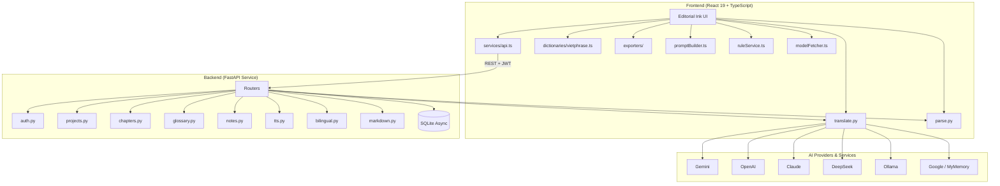

# OmniNovel Studio 📖

<p align="right">
  <a href="README.md">🇻🇳 Tiếng Việt</a> ·
  <strong>🇬🇧 English</strong>
</p>

[](LICENSE)
[](https://github.com/Lacia1803/omninovel-studio/actions/workflows/ci.yml)

**An all‑in‑one studio for translating, converting and publishing bilingual novels — with a consistent Glossary system and 10 AI providers.**

## 📖 Overview

OmniNovel Studio is a **standalone** (All‑in‑one Studio) solution that tackles the pain points of reading and translating web novels / ebooks (Chinese, Japanese, Korean, English):

- **Multi‑source translation**: Seamlessly switch or auto‑fallback between 10 different translation sources.
- **Glossary smart‑prepend**: Lock down character names, locations and cultivation terms before sending to the AI — no more terminology drift between chapters.
- **Client‑side Vietphrase engine**: Runs entirely in the browser — no tokens, no network, zero latency (Hán Việt + Vietphrase dictionaries for Tiên hiệp / Kiếm hiệp / Ngôn tình built‑in).
- **Free Edge TTS**: FastAPI backend uses `edge‑tts` to generate MP3 files (8 Neural voices: Vietnamese, English, Japanese, Korean, Chinese). Reader Mode additionally uses the Web Speech API for instant in‑browser playback.

## ✨ Highlights

- **10 translation providers**: Gemini, OpenAI, Claude, DeepSeek, Mistral, Cohere, Groq, Ollama (local LLM), Google Translate, MyMemory (free).
- **Auto‑fallback**: Automatically switches to a backup provider on rate‑limit or network error — your progress is never lost.
- **4 translation styles**: Literary, Wuxia, Literal, Custom.
- **3‑column Pipeline view**: Side‑by‑side comparison of *Original*, *Vietphrase* and *AI Translation*. Edit or re‑translate any segment instantly.
- **Multiple input formats**: TXT, EPUB, PDF, DOCX, JSON/`.novelproject`, pasted raw text or HTML.
- **Multiple output formats**:
  - **Frontend (client-side)**: EPUB (single-language), PDF, DOCX, TXT, Markdown, `.novelproject` (JSON backup).
  - **Backend (via API)**: Bilingual EPUB (`/bilingual`), server-side Markdown (`/markdown`), TTS MP3 (`/tts`).
- **Free Edge TTS**: 8 Neural voices from Microsoft Edge (Vietnamese, English, Japanese, Korean, Chinese) via the FastAPI backend, with adjustable speed.
- **Glossary & Rules manager**: Add/edit/delete terminology, toggle per project; the rule service can transform text before or after translation.

## 🛠️ Tech Stack

| Layer | Technologies / Libraries |
|-------|--------------------------|
| **Frontend** | React 19, Vite, TypeScript (strict), custom CSS, `pdfjs-dist`, `docx`, `jszip`, `jspdf` |
| **Backend** | Python 3.11, FastAPI, `aiosqlite`, `httpx`, `edge-tts` |
| **Database** | SQLite (async) |
| **Parsers (FE)** | `pdfjs-dist`, `jszip` (EPUB/DOCX), auto-detect UTF-8/GBK |
| **Parsers (BE)** | `chardet`, `PyMuPDF`, `python-docx`, `ebooklib` |
| **Audio & TTS** | Edge TTS (`edge-tts` 6.x) + Web Speech API (FE) |
| **Security & Ops** | JWT auth (`python-jose`), `bcrypt`, `slowapi` (rate limit), `loguru` (structured logging) |
| **Desktop & Container** | Tauri v2, Docker Compose (Nginx + FastAPI) |
| **Testing** | Vitest (frontend), Pytest (backend) |

## 🏗️ System Architecture



## 📂 Project Structure

```text
omninovel-studio/
├── src/                          # React frontend
│   ├── components/               # UI components
│   ├── hooks/                    # Custom React hooks
│   ├── services/
│   │   ├── api.ts                # REST client + JWT handling
│   │   ├── translators/          # Multi-source engine (10 AI)
│   │   ├── dictionaries/         # Vietphrase + chapter splitter
│   │   ├── exporters/            # EPUB / PDF / DOCX / TXT / MD / JSON
│   │   ├── parsers/              # TXT / EPUB / PDF / DOCX / JSON
│   │   ├── promptBuilder.ts      # Build AI prompts
│   │   ├── ruleService.ts        # Translation rules service
│   │   └── modelFetcher.ts       # Fetch model list per provider
│   └── types/                    # TypeScript interfaces
├── backend/                      # Python FastAPI backend
│   ├── main.py                   # Entrypoint, CORS, middleware
│   ├── security.py               # JWT + bcrypt
│   ├── database.py               # Async SQLite connection & schema
│   ├── models.py                 # Pydantic schemas
│   ├── routers/                  # auth / projects / chapters / glossary
│   │                             # notes / parse / translate / tts
│   │                             # bilingual / markdown
│   └── services/                 # parser / translator / tts
│                                # bilingual_epub / chapter_splitter / glossary
├── src-tauri/                    # Tauri v2 desktop shell
├── docker-compose.yml            # Orchestration for Nginx + FastAPI
├── Dockerfile                    # Docker image for the frontend (nginx)
├── nginx.conf                    # Reverse-proxy config
└── tests/                        # Playwright e2e
```

## 🚀 Installation & Run

### 1. Local Development

**Backend**
```bash
# Move into backend folder (requirements are here)
cd backend

# Create virtual environment
python -m venv venv
# Activate it
# Windows: .\venv\Scripts\activate
# macOS/Linux: source venv/bin/activate

# Install Python dependencies
pip install -r requirements.txt

# (Optional) Set environment variables, e.g.:
# export JWT_SECRET="your-secret"
# export JWT_EXPIRE_HOURS=24

# Start the FastAPI server
uvicorn main:app --reload --port 8000
```

**Frontend** (separate terminal)
```bash
npm install
npm run dev
```

*Frontend*: `http://localhost:5173`  
*Backend API*: `http://localhost:8000/api`

### 2. Docker Compose (production‑ready)

```bash
docker compose up --build -d
```

Nginx serves the frontend on port 80 and proxies all `/api/*` requests to the backend on port 8000.

### 3. Desktop (Tauri v2)

```bash
npm install
npm run tauri:dev
```

### 4. Dev launcher (one command, both services)

A quick-start script is bundled — it auto-creates the `venv`, runs `npm install` if needed, then opens two terminal windows:

**Windows (PowerShell)**
```powershell
.\dev.ps1
```

**macOS / Linux (bash)**
```bash
chmod +x dev.sh stop.sh
./dev.sh
# Stop with: ./stop.sh
```

The script will:
- Create `backend/venv` if missing + install `requirements.txt`
- Run `npm install` if `node_modules` is missing
- Set `JWT_SECRET=dev-secret-change-me` if not already set
- Warn if ports `8000` / `5173` are already in use

After it starts:
- Frontend → `http://localhost:5173`
- Backend → `http://localhost:8000` (Swagger UI: `/docs`)

On bash, logs are written to `.logs/backend.log` and `.logs/frontend.log`.

## 🔑 AI Provider Setup

| Provider | API Key | Cost |
|----------|---------|------|
| **Google Translate** | Not required | Free |
| **MyMemory** | Not required | Free |
| **Ollama** | Install locally | Free |
| **Gemini** | [Google AI Studio](https://aistudio.google.com/apikey?authuser=1) | Free tier |
| **OpenAI** | [OpenAI API](https://platform.openai.com/api-keys) | Pay‑per‑use |
| **Claude** | [Anthropic Console](https://console.anthropic.com/api-keys) | Pay‑per‑use |
| **Mistral** | [Mistral Console](https://console.mistral.ai/api-keys) | Free credits |
| **DeepSeek** | [DeepSeek Platform](https://platform.deepseek.com/api-keys) | Very cheap |
| **Cohere** | [Cohere Dashboard](https://dashboard.cohere.com/api-keys) | Free tier |
| **Groq** | [Groq Console](https://console.groq.com/keys) | Free tier |

You can start using the app right away without an API key — the two free services (Google Translate & MyMemory) cover most needs.

## 🔊 Edge TTS — 8 Neural voices

The backend declares 8 voices in [`backend/services/tts.py`](backend/services/tts.py):

| Voice ID | Language |
|----------|----------|
| `vi-VN-HoaiMyNeural` | Vietnamese (Female) |
| `vi-VN-NamMinhNeural` | Vietnamese (Male) |
| `en-US-JennyNeural` | English (Female) |
| `en-US-GuyNeural` | English (Male) |
| `ja-JP-NanamiNeural` | Japanese (Female) |
| `ko-KR-SunHiNeural` | Korean (Female) |
| `zh-CN-XiaoxiaoNeural` | Chinese (Female) |
| `zh-CN-YunxiNeural` | Chinese (Male) |

Call `POST /api/tts` with `{text, voice, rate}` to receive an `audio/mpeg` stream.

## ⌨️ Default Keyboard Shortcuts

| Shortcut | Action |
|----------|--------|
| `Ctrl + I` | Open the **Import book** panel |
| `Ctrl + E` | Open the **Export** panel |
| `Ctrl + G` | Manage **Glossary** & terms |
| `Ctrl + ,` | Open **Settings** (API keys, theme…) |
| `Ctrl + /` | Toggle **Light / Dark** mode (Editorial Ink) |
| `Ctrl + Shift + B` | Open **Batch Translate** view |

## 🧪 Testing

```bash
# Backend tests
cd backend && pytest

# Frontend tests
npm run test
```

All tests pass (PASS) before every commit.

## 📝 License

Released under the **MIT License**. See the [`LICENSE`](LICENSE) file for details.

---

*Built and maintained by **Lacia** – [GitHub Profile](https://github.com/Lacia1803).*
