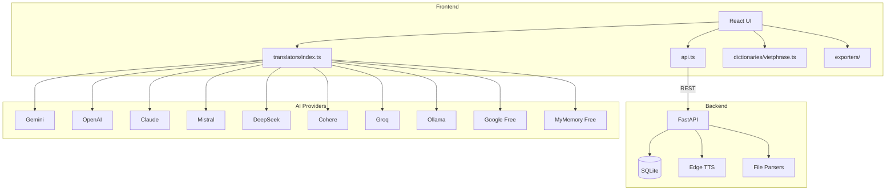

# OmniNovel Studio

> **Phòng thu dịch tiểu thuyết toàn diện** — chuyển đổi, dịch thuật và xuất bản với engine đa nguồn AI.


---

## Tổng quan

OmniNovel Studio là ứng dụng phòng thu dịch tiểu thuyết toàn diện. Backend FastAPI xử lý parse file, TTS và xuất EPUB, frontend React quản lý chỉnh sửa và đọc truyện.

**Kiến trúc**: React frontend → Vite proxy → FastAPI backend → SQLite database.

Thiết kế theo phong cách **Editorial Ink** — giấy ivory, typography serif, accent vermilion — tạo cảm giác chỉnh sửa bản thảo chuyên nghiệp.

## Tính năng chính

### Engine dịch thuật
- **10 nguồn AI**: Gemini, OpenAI, Claude, Mistral, DeepSeek, Cohere, Groq, Ollama, + 2 dịch vụ miễn phí (Google Translate, MyMemory)
- **Tự động chuyển nguồn**: Chuyển sang nguồn miễn phí khi API lỗi
- **Từ điển thuật ngữ (Glossary)**: Đảm bảo tính nhất quán thuật ngữ giữa các chương
- **Phong cách dịch**: Văn học, Tiên hiệp, Sát nghĩa, Tuỳ chỉnh
- **Xử lý hàng loạt**: Dịch nhiều chương với tiến trình thời gian thực

### Pipeline chuyển đổi
- **Chuyển đổi Vietphrase**: Dictionary Han-Viet phía client với glossary tuỳ chỉnh
- **Giao diện 3 cột Pipeline**: So sánh bên cạnh Bản gốc → Vietphrase → Dịch AI với nút dịch lại từng đoạn

### Chuyển đổi giọng nói (TTS)
- **Edge TTS**: TTS neural miễn phí từ Microsoft Edge
- 8 giọng: Việt Nam (Nữ/Nam), English (F/M), Japanese, Korean, Chinese (F/M)
- Tốc độ điều chỉnh được, streaming audio tới trình duyệt

### Hỗ trợ định dạng

| Đầu vào | Đầu ra |
|---------|--------|
| TXT, EPUB, PDF, DOCX | TXT, EPUB, PDF, DOCX, JSON |
| Tự động tách chương bằng regex | EPUB song ngữ (gốc + bản dịch xen kẽ) |
| UTF-8, GBK, Big5, Shift-JIS | |

### Đọc & Chỉnh sửa
- **Pipeline View**: So sánh Bản gốc → Convert → Dịch
- **Song ngữ Parallel**: So sánh từng đoạn gốc/bản dịch
- **Chế độ đọc**: Đọc tập trung với font tuỳ chỉnh và TTS
- **Tìm & Thay thế**: Thay thế hàng loạt trên tất cả nội dung

## Hệ thống thiết kế — Editorial Ink

- **Typography**: Playfair Display (tiêu đề) + Lora (nội dung) + JetBrains Mono (code)
- **Bảng màu**: Giấy ivory / Mực sepia / Accent vermilion / Indigo / Jade
- **Texture**: SVG giấy grain overlay
- **Chế độ sáng/tối**: Full theme toggle với dark variant ấm
- **2,150+ dòng CSS** tự viết — không dùng utility framework

## Stack công nghệ

| Tầng | Công nghệ |
|------|-----------|
| Frontend | React 19, Vite 8, TypeScript 6 |
| Backend | Python 3.11, FastAPI, aiosqlite |
| Database | SQLite (raw SQL, async) |
| TTS | Edge TTS (miễn phí, cloud) |
| Parse | chardet, PyMuPDF, python-docx, ebooklib |
| Build | Vite + TypeScript strict mode |
| Lint | oxlint |
| Test | Vitest (unit), Pytest (backend) |
| Container | Docker Compose (Nginx + FastAPI) |
| Desktop | Tauri v2 (tuỳ chọn) |

## Kiến trúc



## Cấu trúc dự án

```
├── src/                        # React frontend
│   ├── components/             # UI components
│   │   └── ErrorBoundary.tsx   # Lỗi render graceful
│   ├── hooks/                  # Custom React hooks
│   │   ├── useProject.ts       # Quản lý project state
│   │   ├── useTheme.ts         # Dark/Light theme
│   │   └── useKeyboardShortcuts.ts
│   ├── services/
│   │   ├── api.ts              # REST client → FastAPI
│   │   ├── translators/        # Engine đa nguồn
│   │   ├── dictionaries/       # Vietphrase client-side
│   │   └── exporters/          # EPUB/PDF/DOCX/TXT
│   └── types/                  # TypeScript types
├── backend/                    # Python FastAPI
│   ├── main.py                 # Entry, CORS, routers
│   ├── database.py             # SQLite schema + async
│   ├── models.py               # Pydantic schemas
│   ├── routers/                # API endpoints (7 routers)
│   └── services/               # Business logic (6 services)
├── docker-compose.yml          # Production deployment
├── Dockerfile                  # Frontend (Nginx)
└── nginx.conf                  # SPA routing + API proxy
```

## Bắt đầu

### Phát triển (web)

```bash
# Backend
cd backend
python -m venv venv
# Windows: .\venv\Scripts\activate
# macOS/Linux: source venv/bin/activate
pip install -r requirements.txt
uvicorn main:app --reload --port 8000

# Frontend (terminal riêng)
npm install
npm run dev
```

Frontend tại `http://localhost:5173`, backend API tại `http://localhost:8000/api`.

### Docker Compose

```bash
docker compose up --build
```

Frontend qua Nginx trên port 80, API proxy tới backend trên port 8000.

### Desktop (Tauri)

```bash
npm install
npm run tauri:dev
```

## Cấu hình nguồn API

| Nguồn | Nguồn API Key | Miễn phí |
|--------|--------------|----------|
| Google Translate | Không cần key | ✅ |
| MyMemory | Không cần key | ✅ |
| Gemini | [aistudio.google.com](https://aistudio.google.com/apikey) | Free tier hào phóng |
| OpenAI | [platform.openai.com](https://platform.openai.com/api-keys) | Pay-per-use |
| Claude | [console.anthropic.com](https://console.anthropic.com/api-keys) | Pay-per-use |
| Mistral | [console.mistral.ai](https://console.mistral.ai/api-keys) | Free credits |
| DeepSeek | [platform.deepseek.com](https://platform.deepseek.com/api-keys) | Rất rẻ |
| Cohere | [dashboard.cohere.com](https://dashboard.cohere.com/api-keys) | Free tier |
| Groq | [console.groq.com](https://console.groq.com/api-keys) | Free tier |
| Ollama | Cài đặt local | ✅ Luôn miễn phí |

## Phím tắt

| Phím | Hành động |
|------|-----------|
| `Ctrl+I` | Mở Import |
| `Ctrl+E` | Mở Export |
| `Ctrl+G` | Mở Glossary |
| `Ctrl+,` | Mở Settings |
| `Ctrl+/` | Bật/Tắt Sáng/Tối |
| `Ctrl+Shift+B` | Mở Batch Translate |

## Giấy phép

MIT
