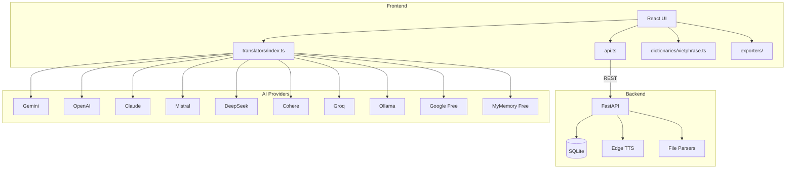

# OmniNovel Studio

> **A full-stack translation studio for novels** — convert, translate, and publish with AI-powered multi-provider engine.


---

## Overview

OmniNovel Studio is a full-stack translation studio for novels. It features a Python FastAPI backend for processing (file parsing, TTS, EPUB generation) and a React frontend for editing and reading.

**Architecture**: React frontend → Vite proxy → FastAPI backend → SQLite database.

Built with a distinctive **Editorial Ink** aesthetic — ivory paper, serif typography, vermilion accents — designed to feel like a proper manuscript editor.

## Key Features

### Translation Engine
- **10 AI providers**: Gemini, OpenAI, Claude, Mistral, DeepSeek, Cohere, Groq, Ollama, + 2 free services (Google Translate, MyMemory)
- **Multi-provider fallback**: Auto-switches to free providers on API errors
- **Glossary system**: Maintain terminology consistency across chapters with pre-translation term replacement
- **Style presets**: Literary, Wuxia, Literal, Custom prompt — control translation style per project
- **Batch processing**: Translate multiple chapters with live progress tracking

### Convert Pipeline
- **Vietphrase conversion**: Client-side Han-Viet dictionary with custom glossary support
- **3-column Pipeline View**: Side-by-side Original → Vietphrase → AI Translation with paragraph-level retranslate

### Text-to-Speech (TTS)
- **Edge TTS**: Free cloud neural TTS via Microsoft Edge
- 8 voices: Vietnamese (F/M), English (F/M), Japanese, Korean, Chinese (F/M)
- Adjustable speech rate, audio streaming to browser

### Format Support

| Input | Output |
|-------|--------|
| TXT, EPUB, PDF, DOCX | TXT, EPUB, PDF, DOCX, JSON |
| Auto chapter-split with regex | Bilingual EPUB (interleaved original + translation) |
| UTF-8, GBK, Big5, Shift-JIS detection | |

### Reading & Editing
- **Pipeline View**: Original → Convert → Translate comparison
- **Parallel Dual View**: Side-by-side original/translated per paragraph
- **Reader Mode**: Distraction-free reading with adjustable font and TTS playback
- **Find & Replace**: Bulk text replacement across all content fields

## Design System — Editorial Ink

- **Typography**: Playfair Display (headings) + Lora (body) + JetBrains Mono (code)
- **Palette**: Ivory paper / Sepia ink / Vermilion accent / Indigo / Jade
- **Texture**: SVG paper grain overlay
- **Dark/Light theme**: Full theme toggle with warm dark variant
- **1,900+ lines** of hand-crafted CSS — no utility framework

## Tech Stack

| Layer | Technology |
|-------|-----------|
| Frontend | React 19, Vite 8, TypeScript 6 |
| Backend | Python 3.11, FastAPI, aiosqlite |
| Database | SQLite (raw SQL, async) |
| TTS | Edge TTS (free, cloud) |
| Parsers | chardet, PyMuPDF, python-docx, ebooklib |
| Build | Vite + TypeScript strict mode |
| Lint | oxlint |
| Tests | Vitest (unit), Pytest (backend) |
| Container | Docker Compose (Nginx + FastAPI) |
| Desktop | Tauri v2 (optional) |

## Architecture



## Project Structure

```
├── src/                        # React frontend
│   ├── components/             # UI components
│   ├── hooks/                  # Custom React hooks
│   ├── services/api.ts         # API client (REST → FastAPI)
│   ├── services/translators/   # Multi-provider translation engine
│   ├── services/dictionaries/  # Client-side conversion
│   ├── services/exporters/     # Client-side EPUB/PDF/DOCX/TXT export
│   └── types/                  # TypeScript types
├── backend/                    # Python FastAPI server
│   ├── main.py                 # App entry, CORS, router registration
│   ├── database.py             # SQLite schema + async helpers
│   ├── models.py               # Pydantic request/response schemas
│   ├── routers/                # API endpoints
│   │   ├── projects.py         # CRUD + batch translate
│   │   ├── chapters.py         # CRUD
│   │   ├── glossary.py         # CRUD
│   │   ├── translate.py        # Single-text translation
│   │   ├── parse.py            # File upload + parse
│   │   ├── tts.py              # Text-to-speech
│   │   └── bilingual.py        # Bilingual EPUB export
│   ├── services/               # Business logic
│   │   ├── translator.py       # Multi-provider translation engine
│   │   ├── parser.py           # TXT/EPUB/PDF/DOCX parsers
│   │   ├── chapter_splitter.py # Regex chapter detection
│   │   ├── glossary.py         # Pre-translation term replacement
│   │   ├── tts.py              # Edge TTS integration
│   │   └── bilingual_epub.py   # Bilingual EPUB generator
│   └── tests/                  # Pytest tests
├── src-tauri/                  # Tauri desktop wrapper (optional)
├── docker-compose.yml          # Production deployment
├── Dockerfile                  # Frontend (Nginx)
└── nginx.conf                  # SPA routing + API proxy
```

## Getting Started

### Development (web)

```bash
# Backend
cd backend
python -m venv venv
# Windows: .\venv\Scripts\activate
# macOS/Linux: source venv/bin/activate
pip install -r requirements.txt
uvicorn main:app --reload --port 8000

# Frontend (separate terminal)
npm install
npm run dev
```

Frontend at `http://localhost:5173`, backend API at `http://localhost:8000/api`.

### Docker Compose

```bash
docker compose up --build
```

Frontend served via Nginx on port 80, API proxied to backend on port 8000.

### Desktop (Tauri)

```bash
npm install
npm run tauri:dev
```

## API Provider Setup

| Provider | API Key Source | Free Tier |
|----------|---------------|-----------|
| Google Translate | No key needed | ✅ |
| MyMemory | No key needed | ✅ |
| Gemini | [aistudio.google.com](https://aistudio.google.com/apikey) | Generous free tier |
| OpenAI | [platform.openai.com](https://platform.openai.com/api-keys) | Pay-per-use |
| Claude | [console.anthropic.com](https://console.anthropic.com/api-keys) | Pay-per-use |
| Mistral | [console.mistral.ai](https://console.mistral.ai/api-keys) | Free credits |
| DeepSeek | [platform.deepseek.com](https://platform.deepseek.com/api-keys) | Very cheap |
| Cohere | [dashboard.cohere.com](https://dashboard.cohere.com/api-keys) | Free tier |
| Groq | [console.groq.com](https://console.groq.com/api-keys) | Free tier |
| Ollama | Local install | ✅ Always free |

## Keyboard Shortcuts

| Shortcut | Action |
|----------|--------|
| `Ctrl+I` | Open Import |
| `Ctrl+E` | Open Export |
| `Ctrl+G` | Open Glossary |
| `Ctrl+,` | Open Settings |
| `Ctrl+/` | Toggle Dark/Light theme |
| `Ctrl+Shift+B` | Open Batch Translate |

## License

MIT
