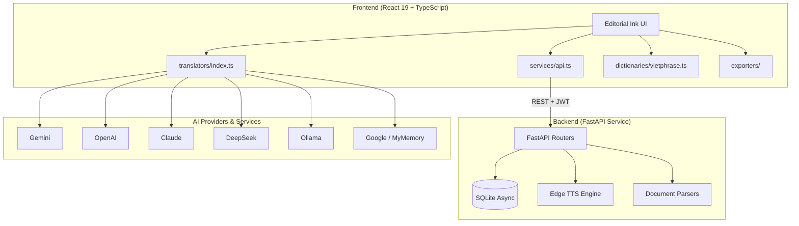

# OmniNovel Studio 📖

<p align="right">
  <a href="README.vi.md">🇻🇳 Tiếng Việt</a> ·
  <strong>🇬🇧 English</strong>
</p>

[](LICENSE)
[](https://github.com/Lacia1803/omninovel-studio/actions/workflows/ci.yml)

**An all‑in‑one studio for translating, converting and publishing bilingual novels — with a consistent Glossary system and 10 AI providers.**

## 📖 Overview
OmniNovel Studio is a **standalone** (All‑in‑one Studio) solution that tackles the pain points of reading and translating web novels / ebooks (Chinese, Japanese, Korean, English):

- **Multi‑source translation**: Seamlessly switch or auto‑fallback between 10 different translation sources.
- **Glossary smart‑prepend**: Lock down character names, locations and cultivation terms before sending to the AI — no more terminology drift between chapters.
- **Client‑side Vietphrase engine**: Runs entirely in the browser — no tokens, no network, zero latency.
- **Bilingual EPUB export**: High‑quality EPUB output with original text and translation interleaved.

## ✨ Highlights
- **10 translation providers**: Gemini, OpenAI, Claude, DeepSeek, Mistral, Cohere, Groq, Ollama (local LLM), Google Translate, MyMemory (free).
- **Auto‑fallback**: Automatically switches to a backup provider on rate‑limit or network error — your progress is never lost.
- **4 translation styles**: Literary, Wuxia, Literal, Custom.
- **3‑column Pipeline view**: Side‑by‑side comparison of *Original*, *Vietphrase* and *AI Translation*. Edit or re‑translate any segment instantly.
- **Free Edge TTS integration**: 8 Neural voices from Microsoft Edge (Vietnamese, English, Japanese, Korean, Chinese) with adjustable speed and inline audio streaming.
- **Format & export**: TXT, EPUB, PDF, DOCX input; bilingual EPUB, Markdown and JSON output.
- **Backend Translation Proxy**: All paid AI providers (OpenAI, Claude, Gemini, etc.) route through secure backend proxy to keep API keys server-side.
- **Enhanced Security**: JWT_SECRET requires environment variable, CORS hardened, authentication added to all CRUD endpoints, API keys stripped from sync.
- **DB Migration Support**: Schema versioning with `schema_version` table for future migrations.
- **Full Auth Protection**: Every endpoint now enforces JWT authentication — no more open projects/chapters/glossary endpoints.

## 🛠️ Tech Stack
| Layer | Technologies / Libraries |
|-------|--------------------------|
| **Frontend** | React 19, Vite, TypeScript (strict), custom CSS |
| **Backend** | Python 3.11, FastAPI, `aiosqlite` |
| **Database** | SQLite (async) |
| **Parsers** | `chardet`, `PyMuPDF`, `python-docx`, `ebooklib` |
| **Audio & TTS** | Edge TTS client integration |
| **Security & Ops** | JWT auth, `bcrypt`, `slowapi` (rate limit), `loguru` (structured logging) |
| **Desktop / Container** | Tauri v2, Docker Compose (Nginx + FastAPI) |
| **Testing** | Vitest (frontend), Pytest (backend) |

## 🏗️ System Architecture


## 📂 Project Structure
```text
omninovel-studio/
├── src/                    # React frontend
│   ├── components/         # UI components
│   ├── hooks/              # Custom React hooks (useProject, useTheme, …)
│   ├── services/
│   │   ├── api.ts          # REST client + JWT handling
│   │   ├── translators/    # Multi‑source engine (10 AI providers)
│   │   ├── dictionaries/   # Client‑side Vietphrase engine
│   │   └── exporters/      # EPUB / PDF / DOCX / TXT exporters
│   └── types/              # TypeScript interfaces
├── backend/                # Python FastAPI backend
│   ├── main.py             # Entrypoint, CORS, middleware & exception handlers
│   ├── security.py         # JWT auth + bcrypt hashing
│   ├── database.py         # Async SQLite connection & schema
│   ├── models.py           # Pydantic schemas
│   ├── routers/            # API endpoints (auth, projects, notes, tts, …)
│   └── services/            # Business logic
├── docker-compose.yml      # Orchestration for Nginx + FastAPI
├── Dockerfile              # Docker image for the frontend (nginx)
└── nginx.conf              # Reverse‑proxy config
```

## 🚀 Installation & Run
### 1. Local Development
**Backend**
```bash
cd backend
python -m venv venv
# Windows: .\venv\Scripts\activate
# macOS/Linux: source venv/bin/activate
pip install -r requirements.txt
uvicorn main:app --reload --port 8000
```

**Frontend** (separate terminal)
```bash
npm install
npm run dev
```

*Frontend*: `http://localhost:5173`  
*Backend API*: `http://localhost:8000/api`

### 2. Docker Compose (production‑ready)
```bash
docker compose up --build -d
```

Nginx serves the frontend on port 80 and proxies all `/api/*` requests to the backend on port 8000.

### 3. Desktop (Tauri v2)
```bash
npm install
npm run tauri:dev
```

## 🔑 AI Provider Setup
| Provider | API Key | Cost |
|----------|---------|------|
| **Google Translate** | Not required | Free |
| **MyMemory** | Not required | Free |
| **Ollama** | Install locally | Free |
| **Gemini** | [Google AI Studio](https://aistudio.google.com/apikey?authuser=1) | Free tier |
| **OpenAI** | [OpenAI API](https://platform.openai.com/api-keys) | Pay‑per‑use |
| **Claude** | [Anthropic Console](https://console.anthropic.com/api-keys) | Pay‑per‑use |
| **Mistral** | [Mistral Console](https://console.mistral.ai/api-keys) | Free credits |
| **DeepSeek** | [DeepSeek Platform](https://platform.deepseek.com/api-keys) | Very cheap |
| **Cohere** | [Cohere Dashboard](https://dashboard.cohere.com/api-keys) | Free tier |
| **Groq** | [Groq Console](https://console.groq.com/keys) | Free tier |

You can start using the app right away without an API key — the two free services (Google Translate & MyMemory) cover most needs.

## ⌨️ Default Keyboard Shortcuts
| Shortcut | Action |
|----------|--------|
| `Ctrl + I` | Open the **Import book** panel |
| `Ctrl + E` | Open the **Export** panel |
| `Ctrl + G` | Manage **Glossary** & terms |
| `Ctrl + ,` | Open **Settings** (API keys, theme…) |
| `Ctrl + /` | Toggle **Light / Dark** mode (Editorial Ink) |
| `Ctrl + Shift + B` | Open **Batch Translate** view |

## 🧪 Testing
```bash
# Backend tests
cd backend && pytest

# Frontend tests
npm run test
```

All tests pass (PASS) before every commit.

## 📝 License
Released under the **MIT License**. See the [`LICENSE`](LICENSE) file for details.

---

*Built and maintained by **Lacia** – [GitHub Profile](https://github.com/Lacia1803).*