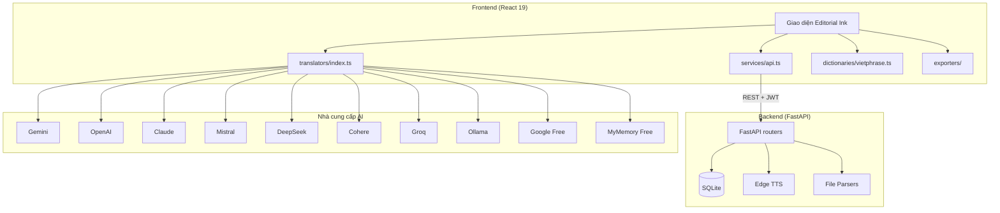

# OmniNovel Studio

> Một ứng dụng duy nhất để dịch, chuyển đổi và xuất bản tiểu thuyết — với glossary nhất quán và mười nguồn AI để lựa chọn.


---

## Vì sao OmniNovel Studio tồn tại

Bạn mở một cuốn tiểu thuyết Trung, Nhật, Hàn — hay gốc tiếng Anh — và bạn muốn dịch nó để đọc. Bạn không muốn mất tiếng qua Google Translate, không muốn trả tiền cho mỗi chương, và bạn không muốn đánh lại glossary ba lần vì ba dịch vụ khác nhau gọi nhân vật chính bằng ba cái tên.

OmniNovel Studio ra đời để giải quyết đúng cái đó. Một ứng dụng duy nhất, đủ sức nâng một cuốn bản thảo từ file EPUB nguồn, qua chuyển đổi Hán Việt hoặc dịch thuật AI, đến xuất bản EPUB song ngữ — mà không bao giờ mất kiểm soát thuật ngữ giữa đường.

## Cảm hứng thiết kế

Phần lớn phần mềm dịch thuật trông như bảng tính. OmniNovel Studio trông như một phòng đọc sách.

Chúng tôi gọi hệ thống thiết kế này là **Editorial Ink**: giấy ivory ấm áp, typography serif từ Playfair Display và Lora, điểm nhấn vermilion như con dấu son truyền thống Á Đông. Khi bạn bật chế độ tối, mọi thứ chuyển sang tông mực sepia ấm — không phải nền đen lạnh. Bạn đang dịch sách, không phải code bash script.

Toàn bộ giao diện được viết tay bằng hơn 2.100 dòng CSS. Không framework utility, không Tailwind. Mỗi khoảng cách, mỗi độ bóng đều có chủ đích.

## Tính năng

### Engine dịch thuật — mười nguồn, một giao diện

Bạn có thể chọn trong số mười nhà cung cấp — từ Gemini, OpenAI, Claude, DeepSeek, đến hai dịch vụ miễn phí không cần API key (Google Translate, MyMemory) và Ollama chạy hoàn toàn trên máy của bạn.

Khi một nguồn lỗi, OmniNovel Studio tự chuyển sang nguồn dự phòng mà không làm bạn mất chương đang dịch dở. Glossary của bạn — danh sách tên nhân vật, địa danh, thuật ngữ tu tiên — được áp dụng **trước** khi gửi cho AI, đảm bảo chương 1 và chương 999 dịch cùng một tên cho "Lão Tổ".

Bốn phong cách dịch cài sẵn: Văn học, Tiên hiệp, Sát nghĩa, Tuỳ chỉnh. Bạn muốn dịch kiểu web novel hay kiểu sách in — bạn quyết.

### Vietphrase client-side — không phụ thuộc server

Bạn muốn chuyển Hán Việt truyện kiếm hiệp? Bạn có thể làm ngay trong trình duyệt mà không cần gọi API, không tốn token, không chờ mạng. Từ điển nằm gọn trong client, glossary bạn thêm được nạp vào ngay.

Giao diện **ba cột Pipeline** đặt Bản gốc, Vietphrase, và Bản dịch cạnh nhau. Bạn thấy ngay chỗ nào Vietphrase sai, nhấn nút, dịch lại từng đoạn — không phải dịch lại cả chương.

### Giọng nói — Edge TTS miễn phí

Tám giọng neural từ Microsoft Edge, không tốn đồng nào: Việt Nam (Nữ, Nam), Anh (Nữ, Nam), Nhật, Hàn, Trung (Nữ, Nam). Tốc độ điều chỉnh được, audio stream thẳng tới trình duyệt. Bạn nghe thử giọng ngay trong giao diện, không cần mở tab khác.

### Định dạng vào ra — không bắt bạn sửa file

Đầu vào: TXT, EPUB, PDF, DOCX. Đầu ra: TXT, EPUB song ngữ (nguyên bản + bản dịch xen kẽ theo đoạn), Markdown, JSON.

Tự động nhận diện encoding: UTF-8, GBK, Big5, Shift-JIS. Tự động tách chương bằng regex — bạn có thể tuỳ chỉnh regex nếu truyện của bạn dùng format lạ.

### Ba chế độ đọc

**Pipeline View** để bạn so sánh bản gốc với chuyển đổi và bản dịch cùng lúc. **Parallel Dual** đặt từng đoạn gốc-bản dịch cạnh nhau — lý tưởng để review thuật ngữ. **Reader Mode** biến cửa sổ thành phòng đọc: font lớn hơn, lề rộng hơn, TTS nút ngay cạnh đoạn văn. Muốn thay một tên xuyên suốt truyện? Tìm và thay thế chạy trên toàn bộ chương trong một lần.

### Ghi chú từng chương

Đôi khi bạn cần ghi lại "chỗ này cần review lại" hoặc "phần này AI dịch sai". Notes gắn liền với từng chương, lưu trên server, hiện ngay cạnh nội dung.

### Bảo mật và vận hành

Đăng ký, đăng nhập với JWT. Mật khẩu hash bằng bcrypt. Rate limit (slowapi) chặn lạm dụng. Mọi request được log structured (loguru) với thời gian xử lý — bạn biết chính xác endpoint nào chậm, request nào lỗi. Global error handler trả về thông báo sạch cho frontend, ghi log đầy đủ cho backend, kèm mã lỗi để bạn tra cứu.

---

## Stack

| Tầng | Công nghệ |
|------|-----------|
| Frontend | React 19, Vite, TypeScript strict mode |
| Backend | Python 3.11, FastAPI, aiosqlite |
| Cơ sở dữ liệu | SQLite (raw SQL, async) |
| TTS | Edge TTS (miễn phí, cloud) |
| Parse | chardet, PyMuPDF, python-docx, ebooklib |
| Xác thực | JWT + bcrypt |
| Rate limit | slowapi |
| Log | loguru |
| Test | Vitest (frontend), Pytest (backend) |
| Đóng gói | Docker Compose (Nginx + FastAPI) |
| Desktop | Tauri v2 (tuỳ chọn) |

---

## Kiến trúc



---

## Cấu trúc dự án

```
ominovel-studio/
├── src/                          # React frontend
│   ├── components/               # UI components
│   ├── hooks/                    # Custom React hooks
│   │   ├── useProject.ts
│   │   ├── useTheme.ts
│   │   └── useKeyboardShortcuts.ts
│   ├── services/
│   │   ├── api.ts                # REST client + JWT
│   │   ├── translators/          # Engine đa nguồn
│   │   ├── dictionaries/         # Vietphrase client-side
│   │   └── exporters/            # EPUB/PDF/DOCX/TXT
│   └── types/                    # TypeScript types
├── backend/                      # Python FastAPI
│   ├── main.py                   # Entry, CORS, routers, middleware
│   ├── security.py               # JWT + bcrypt + auth deps
│   ├── database.py               # SQLite schema + async
│   ├── models.py                 # Pydantic schemas
│   ├── routers/                  # API endpoints
│   └── services/                 # Business logic
├── docker-compose.yml
├── Dockerfile
└── nginx.conf
```

---

## Bắt đầu

### Phát triển web

```bash
# Backend
cd backend
python -m venv venv
# Windows: .\venv\Scripts\activate
# macOS/Linux: source venv/bin/activate
pip install -r requirements.txt
uvicorn main:app --reload --port 8000

# Frontend (terminal riêng)
npm install
npm run dev
```

Frontend chạy tại `http://localhost:5173`, backend API tại `http://localhost:8000/api`.

### Docker Compose

```bash
docker compose up --build
```

Frontend được Nginx phục vụ ở port 80, request `/api/*` được proxy sang backend ở port 8000.

### Desktop (Tauri)

```bash
npm install
npm run tauri:dev
```

---

## Cấu hình nhà cung cấp

| Nhà cung cấp | Lấy API key | Chi phí |
|---|---|---|
| Google Translate | Không cần | Miễn phí |
| MyMemory | Không cần | Miễn phí |
| Gemini | [aistudio.google.com](https://aistudio.google.com/apikey) | Free tier hào phóng |
| OpenAI | [platform.openai.com](https://platform.openai.com/api-keys) | Pay-per-use |
| Claude | [console.anthropic.com](https://console.anthropic.com/api-keys) | Pay-per-use |
| Mistral | [console.mistral.ai](https://console.mistral.ai/api-keys) | Free credits |
| DeepSeek | [platform.deepseek.com](https://platform.deepseek.com/api-keys) | Rất rẻ |
| Cohere | [dashboard.cohere.com](https://dashboard.cohere.com/api-keys) | Free tier |
| Groq | [console.groq.com](https://console.groq.com/keys) | Free tier |
| Ollama | Cài local | Luôn miễn phí |

Bạn không cần API key để bắt đầu. Hai dịch vụ miễn phí sẽ đáp ứng phần lớn nhu cầu.

---

## Phím tắt

| Phím | Hành động |
|------|-----------|
| `Ctrl+I` | Mở Import |
| `Ctrl+E` | Mở Export |
| `Ctrl+G` | Mở Glossary |
| `Ctrl+,` | Mở Settings |
| `Ctrl+/` | Bật / tắt sáng tối |
| `Ctrl+Shift+B` | Mở Batch Translate |

---

## Kiểm thử

```bash
# Backend
cd backend && pytest

# Frontend
npm run test
```

Backend có 27 test, frontend có 15 test, tất cả đều xanh trước mỗi commit.

---

## Giấy phép

MIT