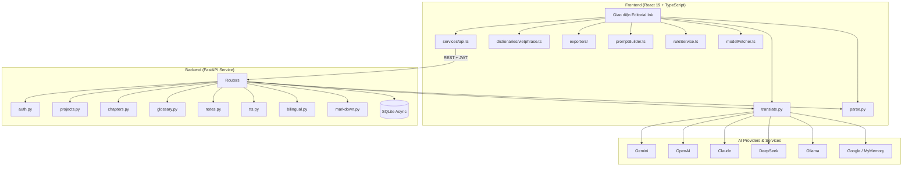

# OmniNovel Studio 📖

<p align="right">
  <strong>🇻🇳 Tiếng Việt</strong> ·
  <a href="README.en.md">🇬🇧 English</a>
</p>

[](LICENSE)
[](https://github.com/Lacia1803/omninovel-studio/actions/workflows/ci.yml)

**Một ứng dụng toàn diện giúp **dịch, chuyển đổi và xuất bản** tiểu thuyết song ngữ với hệ thống Glossary nhất quán và tích hợp 10 nhà cung cấp AI.**

## 📖 Tổng quan

OmniNovel Studio là giải pháp phần mềm **độc lập** (All‑in‑one Studio) giải quyết triệt để các hạn chế của việc đọc và dịch thuật tiểu thuyết web/ebook (Trung, Nhật, Hàn, Anh):

- **Multi‑source translation**: Chuyển đổi hoặc fallback tự động giữa 10 nguồn dịch khác nhau.
- **Glossary smart‑prepend**: Đồng bộ tên nhân vật, địa danh, thuật ngữ tu tiên trước khi gửi tới AI, tránh bất nhất từ ngữ.
- **Client‑side Vietphrase engine**: Chạy hoàn toàn trong trình duyệt, không tốn token, không cần mạng (từ điển Hán Việt + Vietphrase tiên hiệp/kiếm hiệp/ngôn tình tích hợp sẵn).
- **Edge TTS miễn phí**: Backend FastAPI dùng `edge‑tts` (8 giọng Neural: Việt Nam, Anh, Nhật, Hàn, Trung) để sinh file MP3; Reader Mode dùng thêm Web Speech API cho phát nhanh trong trình duyệt.

## ✨ Tính năng nổi bật

- **10 nguồn dịch linh hoạt**: Gemini, OpenAI, Claude, DeepSeek, Mistral, Cohere, Groq, Ollama (Local LLM), Google Translate, MyMemory (miễn phí).
- **Auto‑fallback**: Tự động chuyển sang nhà cung cấp dự phòng khi gặp rate‑limit hoặc ngắt kết nối mà không mất tiến trình.
- **4 phong cách dịch**: Văn học, Tiên hiệp, Sát nghĩa, Tùy chỉnh.
- **Pipeline 3 cột**: So sánh bản gốc, Vietphrase, và bản dịch AI; biện tập, chỉnh sửa ngay lập tức.
- **Đa dạng input**: TXT, EPUB, PDF, DOCX, JSON/`.novelproject`, dán văn bản thô hoặc HTML.
- **Đa dạng output**:
  - **Frontend (client-side)**: EPUB (đơn ngữ), PDF, DOCX, TXT, Markdown, `.novelproject` (JSON backup).
  - **Backend (qua API)**: EPUB song ngữ (`/bilingual`), Markdown server-side (`/markdown`), TTS MP3 (`/tts`).
- **Edge TTS miễn phí**: 8 giọng Neural từ Microsoft Edge (Việt Nam, Anh, Nhật, Hàn, Trung) sinh file MP3 qua backend; tuỳ chỉnh tốc độ.
- **Quản lý Glossary & Rules**: Thêm/sửa/xoá thuật ngữ, bật/tắt theo dự án, rule service cho phép biến đổi văn bản trước/sau dịch.

## 🛠️ Tech Stack

| Tầng | Công nghệ / Thư viện |
|------|----------------------|
| **Frontend** | React 19, Vite, TypeScript (strict), custom CSS, `pdfjs-dist`, `docx`, `jszip`, `jspdf` |
| **Backend** | Python 3.11, FastAPI, `aiosqlite`, `httpx`, `edge-tts` |
| **Database** | SQLite (async) |
| **Parsers (FE)** | `pdfjs-dist`, `jszip` (EPUB/DOCX), auto-detect UTF-8/GBK |
| **Parsers (BE)** | `chardet`, `PyMuPDF`, `python-docx`, `ebooklib` |
| **Audio & TTS** | Edge TTS (`edge-tts` 6.x) + Web Speech API (FE) |
| **Security & Ops** | JWT auth (`python-jose`), `bcrypt`, `slowapi` (rate limit), `loguru` (structured logging) |
| **Desktop & Container** | Tauri v2, Docker Compose (Nginx + FastAPI) |
| **Testing** | Vitest (frontend), Pytest (backend) |

## 🏗️ Kiến trúc hệ thống



## 📂 Cấu trúc dự án

```text
omninovel-studio/
├── src/                          # React frontend
│   ├── components/               # UI components
│   ├── hooks/                    # Custom React hooks
│   ├── services/
│   │   ├── api.ts                # REST client + JWT handling
│   │   ├── translators/          # Engine đa nguồn (10 AI)
│   │   ├── dictionaries/         # Vietphrase + chapter splitter
│   │   ├── exporters/            # EPUB / PDF / DOCX / TXT / MD / JSON
│   │   ├── parsers/              # TXT / EPUB / PDF / DOCX / JSON
│   │   ├── promptBuilder.ts      # Xây prompt cho AI
│   │   ├── ruleService.ts        # Dịch vụ quản lý rule
│   │   └── modelFetcher.ts       # Lấy model theo provider
│   └── types/                    # TypeScript interfaces
├── backend/                      # Python FastAPI backend
│   ├── main.py                   # Entrypoint, CORS, middleware
│   ├── security.py               # JWT + bcrypt
│   ├── database.py               # Async SQLite connection & schema
│   ├── models.py                 # Pydantic schemas
│   ├── routers/                  # auth / projects / chapters / glossary
│   │                             # notes / parse / translate / tts
│   │                             # bilingual / markdown
│   └── services/                 # parser / translator / tts
│                                # bilingual_epub / chapter_splitter / glossary
├── src-tauri/                    # Tauri v2 desktop shell
├── docker-compose.yml            # Orchestration cho Nginx + FastAPI
├── Dockerfile                    # Docker image cho frontend (nginx)
├── nginx.conf                    # Reverse-proxy config
└── tests/                        # Playwright e2e
```

## 🚀 Hướng dẫn cài đặt & chạy

### 1. Phát triển cục bộ

**Backend**
```bash
# Di chuyển vào thư mục backend (nơi chứa requirements)
cd backend

# Tạo môi trường ảo
python -m venv venv
# Kích hoạt môi trường ảo
# Windows: .\venv\Scripts\activate
# macOS/Linux: source venv/bin/activate

# Cài đặt các dependencies của Python
pip install -r requirements.txt

# (Tùy chọn) Đặt các biến môi trường, ví dụ:
# export JWT_SECRET="your-secret"
# export JWT_EXPIRE_HOURS=24

# Khởi động FastAPI server
uvicorn main:app --reload --port 8000
```

**Frontend** (trong terminal riêng)
```bash
npm install
npm run dev
```

*Frontend*: `http://localhost:5173`  
*Backend API*: `http://localhost:8000/api`

### 2. Docker Compose (production‑ready)

```bash
docker compose up --build -d
```

Frontend được Nginx phục vụ trên port 80, mọi request `/api/*` được proxy tới backend trên port 8000.

### 3. Desktop (Tauri v2)

```bash
npm install
npm run tauri:dev
```

## 🔑 Thiết lập Nhà cung cấp AI

| Nhà cung cấp | Nhận API Key | Chi phí |
|-------------|--------------|---------|
| **Google Translate** | Không cần | Miễn phí |
| **MyMemory** | Không cần | Miễn phí |
| **Ollama** | Cài đặt local | Miễn phí |
| **Gemini** | [Google AI Studio](https://aistudio.google.com/apikey?authuser=1) | Free tier |
| **OpenAI** | [OpenAI API](https://platform.openai.com/api-keys) | Pay‑per‑use |
| **Claude** | [Anthropic Console](https://console.anthropic.com/api-keys) | Pay‑per‑use |
| **Mistral** | [Console Mistral](https://console.mistral.ai/api-keys) | Free credits |
| **DeepSeek** | [DeepSeek Platform](https://platform.deepseek.com/api-keys) | Rất rẻ |
| **Cohere** | [Cohere Dashboard](https://dashboard.cohere.com/api-keys) | Free tier |
| **Groq** | [Groq Console](https://console.groq.com/keys) | Free tier |

Bạn có thể bắt đầu ngay mà không cần API key – hai dịch vụ miễn phí (Google Translate & MyMemory) đáp ứng hầu hết nhu cầu.

## 🔊 Edge TTS — 8 giọng Neural

Backend khai báo sẵn 8 giọng (xem [`backend/services/tts.py`](backend/services/tts.py)):

| Voice ID | Ngôn ngữ |
|----------|----------|
| `vi-VN-HoaiMyNeural` | Tiếng Việt (Nữ) |
| `vi-VN-NamMinhNeural` | Tiếng Việt (Nam) |
| `en-US-JennyNeural` | English (Female) |
| `en-US-GuyNeural` | English (Male) |
| `ja-JP-NanamiNeural` | Tiếng Nhật (Nữ) |
| `ko-KR-SunHiNeural` | Tiếng Hàn (Nữ) |
| `zh-CN-XiaoxiaoNeural` | Tiếng Trung (Nữ) |
| `zh-CN-YunxiNeural` | Tiếng Trung (Nam) |

Gọi API `POST /api/tts` với `{text, voice, rate}` để nhận về `audio/mpeg`.

## ⌨️ Phím tắt mặc định

| Phím | Hành động |
|------|-----------|
| `Ctrl + I` | Mở nhanh bảng **Import sách** |
| `Ctrl + E` | Mở bảng **Export dữ liệu** |
| `Ctrl + G` | Quản lý **Glossary & thuật ngữ** |
| `Ctrl + ,` | Mở **Settings** (cấu hình API key, theme…) |
| `Ctrl + /` | Chuyển đổi giao diện **Sáng / Tối** (Editorial Ink) |
| `Ctrl + Shift + B` | Mở giao diện **Dịch hàng loạt** (Batch Translate) |

## 🧪 Testing

```bash
# Backend tests
cd backend && pytest

# Frontend tests
npm run test
```

Tất cả test đều xanh (PASS) trước mỗi commit.

## 📝 Giấy phép

Dự án được phát hành dưới giấy phép **MIT**. Xem chi tiết trong file `LICENSE`.

---

*Được phát triển và duy trì bởi **Lacia** – [GitHub Profile](https://github.com/Lacia1803).*